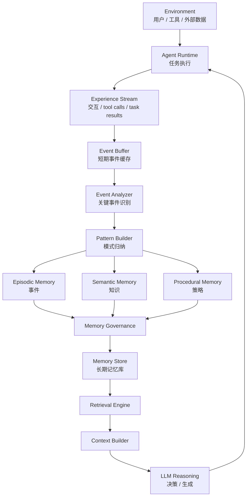
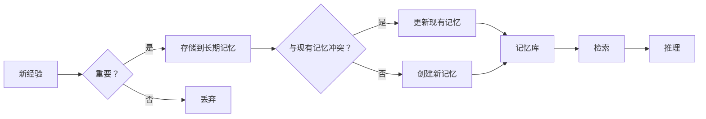

以下内容为在遇到 openclaw 总忘记经验的情况下，从 gpt 探索出来的记忆治理架构
基于一些理解我也尝试 vibecoding 一个最小可行性产品 (MVP) 版本的记忆治理层 [Agent-Memory](https://github.com/leapx-ai/Agent-Memory)

---

# Agent Memory Governance — 认知架构图



---

# 一、系统分为四个核心层

整个架构可以理解为四层。

```text
1 Experience Layer
2 Pattern Layer
3 Memory Governance Layer
4 Reasoning Layer
```

## 1. Experience Layer（经验层）

经验层负责记录所有交互历史。

## 2. Pattern Layer（模式层）

模式层负责从经验中提取模式。

## 3. Memory Governance Layer（记忆治理层）

记忆治理层负责管理记忆的存储、检索和更新。

## 4. Reasoning Layer（推理层）

推理层负责基于记忆进行推理和决策。

---

# 二、记忆治理层的核心功能

记忆治理层的核心功能包括：



---

# 三、实现建议

1. **事件驱动**：使用事件流记录所有交互
2. **模式提取**：定期从经验中提取模式
3. **记忆更新**：根据新经验更新记忆
4. **检索优化**：使用向量数据库加速检索

---

# 四、总结

记忆治理是 Agent 系统的核心组件，它决定了 Agent 能否从经验中学习和成长。
