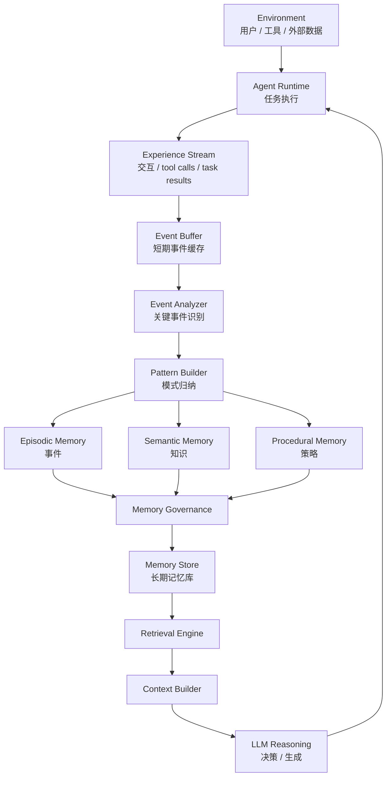

以下内容为在遇到openclaw总忘记经验的情况下，从gpt探索出来的记忆治理架构
基于一些理解我也尝试vibecoding一个最小可行性产品(MVP)版本的记忆治理层 [Agent-Memory](https://github.com/leapx-ai/Agent-Memory)

---

# Agent Memory Governance — 认知架构图



---

# 一、系统分为四个核心层

整个架构可以理解为四层。

```text
1 Experience Layer
2 Pattern Layer
3 Memory Governance Layer
4 Reasoning Layer
```

这四层形成 **经验学习闭环**。

---

# 二、Experience Layer（经验层）

输入是所有 Agent 真实行为。

来源：

```
conversation
tool_calls
task_execution
user_feedback
errors
```

这些数据组成：

```
Experience Stream
```

特点：

```
高频
噪声多
信息密度低
```

因此不能直接进入长期记忆。

---

# 三、Pattern Layer（模式层）

这一层是 **记忆系统的核心智能部分**。

流程：

```
events
→ clustering
→ pattern
```

目标是把大量事件压缩成少量规律。

例如：

事件：

```
用户三次要求先给结构
```

模式：

```
用户偏好结构化回答
```

再进一步：

```
pattern → strategy
```

得到：

```
if answer > 200 words
→ show outline first
```

---

# 四、三种记忆类型

模式层产生三类长期记忆。

---

## 1 Episodic Memory

记录事件。

结构：

```
event
context
result
timestamp
```

作用：

```
历史回溯
经验分析
```

问题：

```
规模会快速增长
```

因此必须压缩。

---

## 2 Semantic Memory

记录知识。

例如：

```
用户偏好
环境规则
领域知识
```

结构：

```
fact
relationship
confidence
```

作用：

```
长期知识
```

---

## 3 Procedural Memory

最重要的一类。

记录 **行为策略**：

```
condition → action
```

例如：

```
if task_complexity > threshold
→ generate_plan_first
```

它直接改变 Agent 行为。

---

# 五、Memory Governance（记忆治理）

治理层负责四件事：

```
admission
weighting
merge
decay
```

---

## 1 Admission（准入）

决定是否进入长期记忆。

评分函数：

```
MemoryScore =
novelty
+ user_signal
+ task_impact
+ recurrence
```

只有高价值模式进入长期记忆。

---

## 2 Weighting（权重）

每条记忆都有影响权重。

示例：

```
weight =
0.4 confidence
+0.3 recurrence
+0.2 user_signal
+0.1 recency
```

权重决定：

```
检索优先级
行为影响力
```

---

## 3 Merge（合并）

相似记忆会合并。

例如：

```
用户不喜欢长回答
用户喜欢结构化回答
```

合并为：

```
用户偏好结构化表达
```

这一步是 **记忆压缩的关键**。

---

## 4 Decay（衰减）

长期未使用的记忆会衰减。

规则：

```
weight = weight × decay_factor
```

最终可能被删除。

目的：

```
控制记忆规模
```

---

# 六、Retrieval Engine（记忆检索）

在推理前检索相关记忆。

排序依据：

```
semantic similarity
memory weight
context relevance
```

只返回：

```
top-k memories
```

避免 context 污染。

---

# 七、Context Builder（上下文构建）

这一层解决 LLM 的核心限制：

```
context window
```

输入：

```
task
retrieved memories
recent events
```

输出：

```
optimized context package
```

用于 LLM 推理。

---

# 八、Agent 行为闭环

系统形成持续学习循环：

```
experience
→ pattern extraction
→ strategy memory
→ behavior update
→ new experience
```

即：

```
experience → learning → evolution
```

这就是 **Self-Evolving Agent 的基础机制**。

---

# 九、最关键的系统约束

一个稳定的 Agent Memory System 必须满足：

```
memory_growth << interaction_growth
```

也就是说：

```
记忆规模增长
远小于
交互规模增长
```

实现方法：

```
events → patterns → strategies
```

例如：

```
10000 events
→ 200 patterns
→ 50 strategies
```

---

# 十、最终认知框架（最重要）

Agent Memory System 的真正结构是：

```
Experience System
        ↓
Pattern Learning
        ↓
Strategy Memory
        ↓
Behavior Optimization
```

而不是：

```
Conversation
→ Vector Database
```

---


