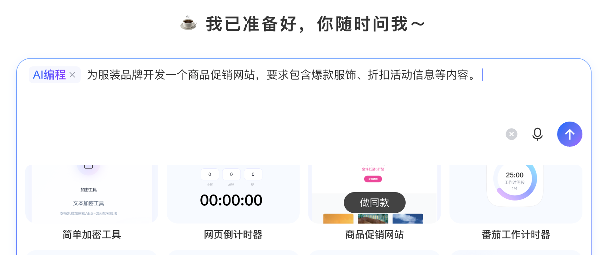

> 总结几点我在vibecoding多个项目后，沉淀的几个比较重要的工作方法


## AI做项目也不轻松

在这之前先说我的感受，虽然AI大大降低了代码实现执行层的成本开销，但面对一个你独立负责的项目你要解决的问题的复杂度可能并未减小，你会多出来大量前置工作，这部分内容会加大你的认知负担；

你提供给模型的上下文信息可能比模型自身的能力更重要，再出色的模型遇到上下文混乱之后，智商都会大打折扣，运气不好的话，你会陷入无休止的问题修复之中。

上下文维护的能力，一个是模型自身的内置能力，另一个是无处不在的上下文工程，你如何沟通，提供什么信息，是怎样的时间线，这些都属于上下文工程的一部分。

## 项目文档

如果你有一个想法，在创建项目之后，一定不要着急开启代码实现，你必须花相当的时间来与AI讨论最重要的前置的工作。你所看到的各大模型站点给出的示例均给出了错误的示范，比如:



注意，一句话是不可以做一个产品的；

项目的第一个文件夹我建议是一份docs目录，SDD（规格驱动开发）核心是把大量本来散落在代码中的信息维护在文档中，文档是它的维护形式，文档内容是我们维护的重要的有关项目的上下文信息。

所以你首先需要创建一系列文档，并持续维护它。

比如：
```text
docs/
  README.md
  foundation/       项目基础定义
  curriculum/       课程体系与探索内容
  product/          产品规格、产品架构与形态
  AI-safety/        AI 交互、安全、隐私与 provider 契约
  design/           视觉、交互与体验设计
  implementation/   技术架构与原型实现计划
  pilot/            MVP 试用、验收与反馈
  operations/       路线图、迭代日志与文档管理
```


## 事情推进前，需要先建立抽象层的“指导基线”

先抽象，再执行
不要一上来做功能，而是先围绕以下方向把基线问题梳理清楚：

围绕
```
目标
理念
核心价值
对象
场景
原则
结构
边界
约束
最小可行路径
```

定义项目北极星：
```
产品理念基线
核心价值基线
目标用户基线
核心场景基线
MVP 范围基线
技术架构基线
视觉交互基线
文档基线
事情推进方法基线
```

这些信息是需要花时间去整理，属于高杠杆信息，对于后续的项目执行有着长远的影响。

有了产品基线信息，AI后续为你提供的需求或者版本规划设计都有了方向。同时你也可以用定义好的边界信息去验证一个需求方向或者执行方式是否符合要求，以形成AI自检；

视觉交互基线，这会影响AI在设计UI时采取什么样的偏好，视觉风格有时候也与产品基调，所面向的用户群体息息相关，所以信息是相互递进的；

MVP的基线，如果你有MVP版本，提前定好基线，避免过度设计与过度实现；

技术架构基线，技术选型需要契合产品发展形态，最好带着你的产品基调与AI做一次讨论。如果你不是技术出身，你不一定要自己定义具体内容，但你必须提前把问题抛出来，让AI来做具体的判断；

文档基线，定义了共识文档的维护规则；


## 遇到问题时识别深层规则

基线驱动的递进式推进，不论何时，你都需要尽量去做：
```
具体问题
行动前：建立基线
行动中：用问题校准基线
行动后：沉淀规则强化基线
下一轮：带着更强基线继续推进
```
文档不是死的，信息不是死的，你需要反馈，迭代，行动，再反馈的循环。

比如我发现kimi code越来越笨，我就定义了AI 协作准则（Agent 行为规范）：
```
1. 独立判断，不迎合表面问题
2. 对项目质量负直接责任
3. 客观验证，用数据说话
4. 架构意识优先
5. 沟通原则
6. 不重复低级错误
```
原则上强大的模型无需这些设定，但当上下文信息开始熵增，有时候你需要明确提出根据协作准则来解决问题。准则是任何时候都适用的，所以非常有必要沉淀。

当一个AI产品，我不希望在AI参与的点上没有规范，于是我讨论出了一份AI能力实现方法论：

核心原则

AI 能力不能完全依赖模型自由发挥。可靠实现应由三部分共同完成：
```
凡是系统已经知道的事实，不应交给 AI 证明；
凡是 AI 推断出的判断，都应标明来源和不确定性；
凡是会改变长期上下文的内容，都必须经过用户确认。
```

上下文构建原则
```
统一的是治理、记录和安全边界；
不同的是每个 AI 任务的输入契约。禁止在页面组件或单次 prompt 中临时拼接不可追溯的上下文。
```
细化到三个能力边界：

```
1. 产品可控层
这层由系统掌握，不依赖 AI 自觉。

2. AI 结构化生成层
这层由 AI 生成，但必须有 schema、校验和失败兜底。

3. AI 解释判断层
这层价值高，但不稳定，必须谨慎表达。
```

UI表达原则：

```
系统事实直接展示
AI 判断谨慎表达
回写必须可确认
数据与追溯要求
```

最后，我们用文档到底是在做啥，我之前也在文章[《为什么 AI 协作开发需要项目上下文系统》](https://mp.weixin.qq.com/s/1yVuqkdT0qJAxTMTvO2UqQ)提到过，文档的核心是要维护5件事：

```
1.入口是否稳定
2.事实是否收口
3.边界是否清楚
4.状态是否可信
5.变更是否可追
```


## 建立审核清单
当你有了基线，自然你可以设定一份审核清单，如果有需要的话：

比如：

气质审核：感觉对吗？

| 检查项 | 通过 | 不通过 |
|--------|------|--------|
| 安静、温和 | ✓ | |
| 有想象力，但不幼稚 | ✓ | |
| 拒绝糖果色、游戏化 | ✓ | |
| 拒绝排行榜、积分、打卡 | ✓ | |
| 拒绝焦虑营销（"不学就落后"） | ✓ | |
| 色彩来自自然、纸张、书本 | ✓ | |
| 蓝紫科技风、高饱和、大面积渐变 | | ✗ |


像测试用例一样让ai自查：
```
任务：每个步骤一个小图标
问题：StepBadge 用 Unicode 符号（✦, ◇, ?），简洁但略单调。
建议：为每个步骤设计一个极简 SVG 小图标（安全=小盾牌，材料=调色盘，灵感=灯泡），放在卡片角落，opacity 0.1-0.15。
审核：✅ 有想象力 ✅ 不幼稚（抽象图标）✅ 安静（极淡）
```

